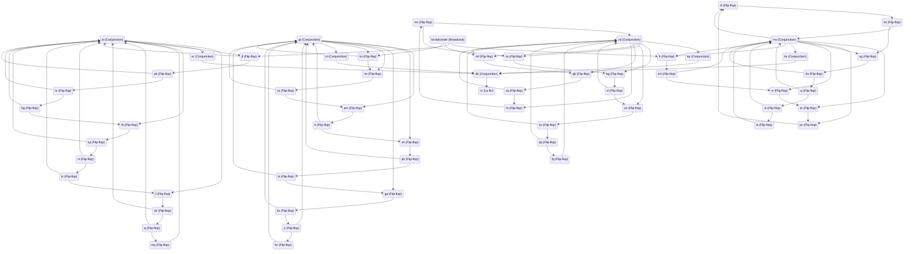

```mermaid
stateDiagram-v2
    state "bs (Flip-flop)" as 55
    55 --> 49
    55 --> 27
    state "nn (Flip-flop)" as 39
    39 --> 56
    state "vr (Flip-flop)" as 28
    28 --> 44
    state "hg (Flip-flop)" as 7
    7 --> 43
    7 --> 0
    state "xd (Conjunction)" as 15
    15 --> 32
    15 --> 33
    15 --> 16
    15 --> 20
    15 --> 34
    15 --> 35
    15 --> 12
    state "fr (Flip-flop)" as 47
    47 --> 27
    47 --> 29
    state "bj (Flip-flop)" as 24
    24 --> 15
    state "br (Flip-flop)" as 44
    44 --> 10
    state "xl (Flip-flop)" as 57
    57 --> 15
    57 --> 20
    state "bg (Flip-flop)" as 33
    33 --> 57
    state "jl (Flip-flop)" as 13
    13 --> 18
    state "qb (Flip-flop)" as 35
    35 --> 26
    state "bx (Flip-flop)" as 52
    52 --> 4
    52 --> 2
    state "fh (Flip-flop)" as 43
    43 --> 22
    state "zq (Flip-flop)" as 26
    26 --> 15
    26 --> 12
    state "vl (Flip-flop)" as 21
    21 --> 0
    21 --> 14
    state "pm (Flip-flop)" as 36
    36 --> 51
    state "broadcaster (Broadcast)" as 53
    53 --> 47
    53 --> 42
    53 --> 34
    53 --> 40
    state "dp (Flip-flop)" as 25
    25 --> 24
    25 --> 15
    state "zt (Conjunction)" as 0
    0 --> 13
    0 --> 41
    0 --> 42
    0 --> 43
    state "ms (Conjunction)" as 27
    27 --> 44
    27 --> 9
    27 --> 10
    27 --> 45
    27 --> 28
    27 --> 46
    27 --> 47
    state "sj (Flip-flop)" as 17
    17 --> 1
    17 --> 0
    state "ks (Conjunction)" as 46
    46 --> 30
    state "cb (Flip-flop)" as 18
    18 --> 17
    18 --> 0
    state "ct (Conjunction)" as 31
    31 --> 30
    state "xj (Flip-flop)" as 49
    49 --> 27
    49 --> 48
    state "zm (Flip-flop)" as 29
    29 --> 27
    29 --> 28
    state "ts (Flip-flop)" as 50
    50 --> 27
    state "gp (Flip-flop)" as 38
    38 --> 52
    state "bb (Conjunction)" as 30
    30 --> 54
    state "vg (Flip-flop)" as 45
    45 --> 55
    state "kx (Flip-flop)" as 19
    19 --> 25
    19 --> 15
    state "qh (Flip-flop)" as 6
    6 --> 2
    6 --> 5
    state "jr (Flip-flop)" as 4
    4 --> 2
    4 --> 3
    state "mf (Flip-flop)" as 34
    34 --> 15
    34 --> 35
    state "bv (Flip-flop)" as 40
    40 --> 2
    40 --> 39
    state "xh (Flip-flop)" as 37
    37 --> 6
    state "mq (Flip-flop)" as 1
    1 --> 0
    state "gt (Conjunction)" as 2
    2 --> 36
    2 --> 37
    2 --> 38
    2 --> 39
    2 --> 40
    2 --> 31
    state "nz (Flip-flop)" as 56
    56 --> 36
    56 --> 2
    state "kt (Flip-flop)" as 5
    5 --> 38
    5 --> 2
    state "jf (Flip-flop)" as 42
    42 --> 0
    42 --> 58
    state "fx (Flip-flop)" as 12
    12 --> 11
    state "kp (Conjunction)" as 32
    32 --> 30
    state "hr (Flip-flop)" as 8
    8 --> 7
    8 --> 0
    state "mv (Flip-flop)" as 11
    11 --> 15
    11 --> 16
    state "nl (Flip-flop)" as 9
    9 --> 23
    state "ss (Flip-flop)" as 16
    16 --> 33
    state "hz (Flip-flop)" as 23
    23 --> 27
    23 --> 45
    state "px (Flip-flop)" as 10
    10 --> 9
    state "xp (Flip-flop)" as 22
    22 --> 21
    22 --> 0
    state "vt (Flip-flop)" as 48
    48 --> 27
    48 --> 50
    state "pd (Flip-flop)" as 58
    58 --> 8
    58 --> 0
    state "sn (Flip-flop)" as 20
    20 --> 19
    state "hv (Flip-flop)" as 3
    3 --> 2
    state "lt (Flip-flop)" as 51
    51 --> 2
    51 --> 37
    state "xc (Conjunction)" as 41
    41 --> 30
    state "tz (Flip-flop)" as 14
    14 --> 13
    14 --> 0
    
    state "rx (La fin)" as 54
```
